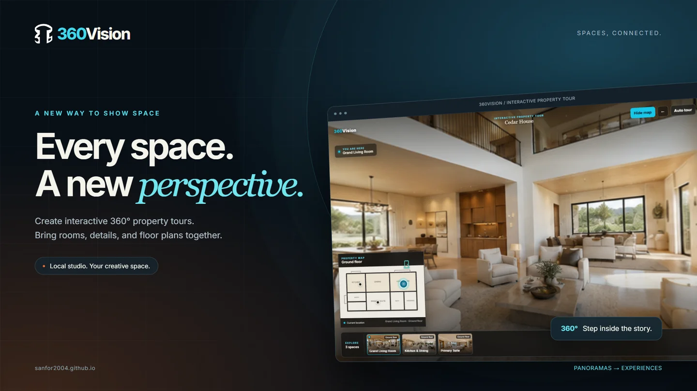
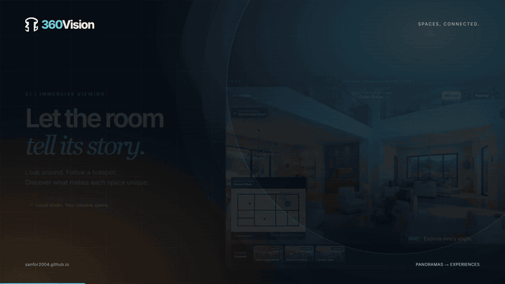
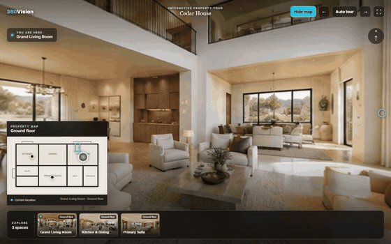

# 360Vision



360Vision is a single-owner local studio for authoring and viewing interactive
real-estate tours. It has no accounts, publication states, public gallery, or
cloud dependency. Each project is a portable JSON file in `data/tours/`.



[Watch the 30-second product film](public/markting/video/360vision-wide.mp4) ·
[Browse the marketing pack](public/markting/README.md) ·
[Source code](https://github.com/sanfor2004/360vesion)

## What is built

- **My work:** create, reopen, copy, and delete local projects.
- **Studio:** panorama scenes, opening camera views, and scene, information,
  text, link, and media hotspots. Edit/View stays visible in a two-row toolbar.
- **Property maps:** optional plans, multiple floors, and responsive navigation
  points. Floor selectors use the shared action-button component.
- **Viewer:** panorama exploration, compact room strip, synchronized map
  navigation, previous/next controls, and an automatic tour mode.
- **Local persistence:** autosave, atomic JSON writes, JSON download, and local
  image processing. Shared button components provide consistent actions.
- **Marketing:** real desktop/mobile captures, ASO-style feature cards,
  lifestyle and studio imagery, social assets, MP4 videos, and looping GIFs.

The bundled `/demo` opens Cedar House with three sample spaces and a floor plan.
The marketing footage uses this sample; lifestyle and hardware images are
AI-generated campaign illustrations. ASO-style cards describe the web product,
not an App Store release.

## Main workflow

1. Open `/dashboard` and create a tour.
2. Add 2:1 equirectangular panoramas in `/studio/[tourId]`.
3. Add angular yaw/pitch hotspots and an optional multi-floor plan.
4. Wait for autosave, then preview the project at `/tour/[tourId]`.
5. Use Save as or Download JSON for a separate copy or backup.



## Stack

- Next.js 16, React 19, and strict TypeScript
- Three.js for authoring
- Photo Sphere Viewer for playback
- Sharp for image processing
- Zod for runtime validation
- Atomic local JSON storage and local uploaded assets

## Setup

Requires Node.js 22 or newer.

```text
npm install
npm run dev
```

Open `http://localhost:3000/dashboard`. No environment file is required.

## Commands

- `npm run dev` — run the local development server.
- `npm run lint` — run strict TypeScript validation.
- `npm run build` — create the production build.
- `npm start` — serve the production build locally.

Generated builds, traces, logs, caches, validation reports, and temporary
screenshots belong under `temp/`. Tour data and uploads remain under
`data/tours/` and `public/uploads/` because they are user-owned runtime data.

## Backup

Back up both `data/tours/` and `public/uploads/`. A tour JSON file references
its images by URL, so both locations are required for a complete restore.

The filesystem implementation is intentionally for one local machine. Do not
expose its unauthenticated write APIs on a public network.

## Marketing and documentation

Open `/markting/index.html` while the app is running to preview and download
the campaign. Final assets live in `public/markting/`; capture frames, browser
diagnostics, and rendering tools live under `temp/`.

[Production workflow](docs/marketing-workflow.md) explains how to capture,
edit, review, and regenerate the assets. The pack includes social captions and
an Astro-compatible draft for `sanfor2004.github.io`, with a Medium version.

JSON download does not bundle images. Complete media-package import/export,
scene reordering, and broader accessibility coverage remain future work.
